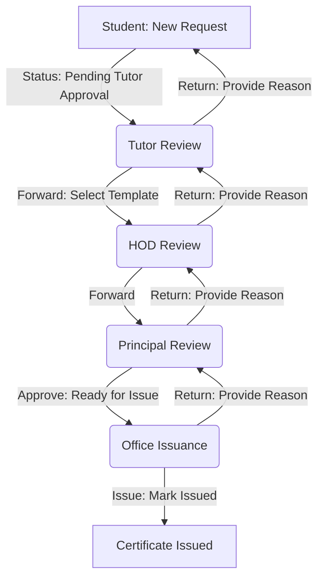

# Bonafide Certificate Workflow & Technology Stack

This document outlines the full lifecycle of a Bonafide Certificate request and the technology stack powering the BCP (Bonafide Certificate Portal).

## Workflow Overview

The workflow follows a hierarchical approval process involving five distinct roles: **Student**, **Tutor**, **HOD**, **Principal**, and **Office**.

### 1. Request Initiation (Student)
- **Action**: Student fills out the "New Request" form (Type, Reason, Sub-type).
- **Initial Status**: `Pending Tutor Approval`
- **Visibility**: Shown in the Student's "My Requests" page.

### 2. Tutor Review
- **Roles Involved**: Tutor assigned to the student's batch.
- **Actions**:
  - **Forward to HOD**: Tutor selects an appropriate **Certificate Template** (HTML). Status: `Pending HOD Approval`.
  - **Return to Student**: Tutor provides a `return_reason`. Status: `Returned to Student`.

### 3. HOD Review
- **Roles Involved**: HOD of the student's department.
- **Actions**:
  - **Forward to Principal**: Status: `Pending Principal Approval`.
  - **Return to Tutor**: HOD provides a `return_reason`. Status: `Returned to Tutor`.

### 4. Principal Review
- **Roles Involved**: College Principal.
- **Actions**:
  - **Approve**: Principal previews the generated certificate. Status: `Ready for Issue`.
  - **Return to HOD**: Principal provides a `return_reason`. Status: `Returned to HOD`.

### 5. Office Issuance (Atomic Generation)
- **Roles Involved**: Office Administration.
- **Actions**:
  - **Issue**: Office triggers the atomic `issue_certificate` RPC.
  - **Result**:
    - Status changes to `Issued`.
    - Unique number generated: `ACE/BC/{Year}/{Sequence}`.
    - `issued_at` timestamp recorded.
    - System prevents further modification of the certificate number.

---

## Technology Stack

The BCP application is built using a modern, scalable web stack:

- **Frontend**: React 18 with Vite and TypeScript.
- **Styling**: Tailwind CSS for responsive and premium UI design.
- **UI Components**: shadcn/ui (based on Radix UI).
- **Backend/Database**: Supabase (PostgreSQL) with Row Level Security (RLS).
- **Backend Logic**: Supabase Edge Functions (Deno) and PL/pgSQL RPCs.
- **PDF Generation**: Custom HTML-to-PDF engine via `jsPDF` and `html2canvas`.
- **Development Assistant**: **Antigravity AI**, used for architectural planning and implementation.

---

## Certificate Numbering Logic

- **Academic Year**: Determined by a June 1st boundary (June to May).
- **Format**: `ACE/BC/YYYY/NNNN` (e.g., `ACE/BC/2026/0001`).
- **Safety**: Concurrency-safe atomic counters stored in `certificate_counters` table.
- **Immutability**: Guaranteed by PostgreSQL triggers.
